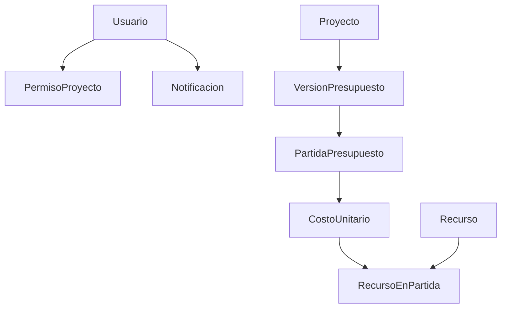
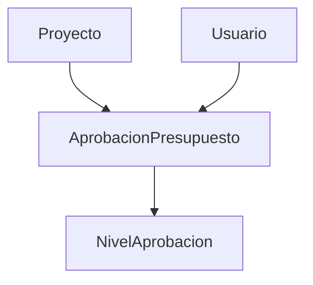

# Sistema de Presupuestos - Interfaces y Relaciones

## Tabla de Contenidos
- [Gestión de Usuarios](#gestión-de-usuarios)
- [Gestión de Proyectos](#gestión-de-proyectos)
- [Recursos y Categorías](#recursos-y-categorías)
- [Análisis y Cálculos](#análisis-y-cálculos)
- [Rendimientos y Fórmulas](#rendimientos-y-fórmulas)
- [Cuadrillas y Metrados](#cuadrillas-y-metrados)
- [Aprobaciones y Permisos](#aprobaciones-y-permisos)
- [Comentarios y Notificaciones](#comentarios-y-notificaciones)
- [Plantillas y Auditoría](#plantillas-y-auditoría)
- [Exportación e Integración](#exportación-e-integración)

## Gestión de Usuarios
### Interface Usuario
Define la estructura base de usuarios del sistema con sus roles y preferencias.

```typescript
interface Usuario {
  id: string;
  nombre: string;
  email: string;
  rol: 'administrador' | 'supervisor' | 'presupuestador' | 'visualizador';
  activo: boolean;
  configuracionNotificaciones: {
    email: boolean;
    sistema: boolean;
    tipos: ('aprobacion' | 'comentario' | 'cambios' | 'mencion')[];
  };
}
```

**Relaciones:**
- Se relaciona con `PermisoProyecto` a través de `usuarioId`
- Se relaciona con `Notificacion` a través de `usuarioId`
- Se relaciona con `RegistroAuditoria` a través de `usuarioId`

## Gestión de Proyectos
### Interface Proyecto
Define la estructura principal de los proyectos de construcción.

```typescript
interface Proyecto {
  id: string;
  nombre: string;
  descripcion?: string;
  fechaCreacion: Date;
  fechaActualizacion: Date;
  estado: 'borrador' | 'enRevision' | 'aprobado' | 'rechazado' | 'archivado';
  versionActualId: string;
  tipoProyecto: 'publico' | 'privado' | 'mixto';
  regionId: string;
  nivelAprobacionActual?: number;
  aprobacionRequerida: boolean;
  plantillaId?: string;
  configuracion: {
    requiereAprobacion: boolean;
    nivelAprobacionRequerido: number;
    permitirComentarios: boolean;
    trackingCambios: boolean;
  };
}
```

**Relaciones:**
- Se relaciona con `VersionPresupuesto` a través de `versionActualId`
- Se relaciona con `PartidaPresupuesto` a través de `proyectoId`
- Se relaciona con `PermisoProyecto` a través de `proyectoId`

### Interface VersionPresupuesto
Define la estructura de las versiones de presupuesto de un proyecto.

```typescript
interface VersionPresupuesto {
  id: string;
  proyectoId: string;
  numeroVersion: number;
  fechaCreacion: Date;
  creadoPor: string;
  descripcion?: string;
}
```

### Interface PartidaPresupuesto
Define la estructura de las partidas de presupuesto dentro de un proyecto.

```typescript
interface PartidaPresupuesto {
  id: string;
  proyectoId: string;
  versionId: string;
  padreId?: string;
  titulo: string;
  nivel: number;
  orden: number;
  esPartidaFinal: boolean;
}
```

## Recursos y Categorías
### Interface Recurso
Define la estructura de los recursos utilizados en los proyectos.

```typescript
interface Recurso {
  id: string;
  codigo: string;
  tipo: 'manoDeObra' | 'equipo' | 'material' | 'servicio';
  categoriaId: string;
  nombre: string;
  descripcion?: string;
  unidadMedida: string;
}
```

### Interface CategoriaRecurso
Define la estructura de las categorías de recursos.

```typescript
interface CategoriaRecurso {
  id: string;
  tipo: 'manoDeObra' | 'equipo' | 'material' | 'servicio';
  nombre: string;
  descripcion?: string;
  categoriaPadreId?: string;
}
```

### Interface PrecioRecurso
Define la estructura de los precios de los recursos.

```typescript
interface PrecioRecurso {
  id: string;
  recursoId: string;
  precio: number;
  fecha: Date;
  regionId: string;
  activo: boolean;
}
```

### Interface Region
Define la estructura de las regiones geográficas.

```typescript
interface Region {
  id: string;
  nombre: string;
  codigo: string;
}
```

### Interface RecursoEnPartida
Define la relación entre recursos y partidas de presupuesto.

```typescript
interface RecursoEnPartida {
  id: string;
  costoUnitarioId: string;
  recursoId: string;
  cantidad: number;
  rendimiento: number;
  precio: number;
  costoTotal: number;
}
```

## Análisis y Cálculos
### Interface AnalisisCostoUnitario
Define la estructura del análisis de costos unitarios.

```typescript
interface AnalisisCostoUnitario {
  id: string;
  costoUnitarioId: string;
  subtotalManoDeObra: number;
  subtotalEquipo: number;
  subtotalMaterial: number;
  subtotalServicio: number;
  costoDirecto: number;
  gastosGenerales: number;
  utilidad: number;
  impuestos: {
    impuestoId: string;
    monto: number;
  }[];
  costoTotal: number;
}
```

### Interface Impuesto
Define la estructura de los impuestos aplicables a los proyectos.

```typescript
interface Impuesto {
  id: string;
  nombre: string;
  porcentaje: number;
  regionId: string;
  tipoProyecto: 'publico' | 'privado' | 'mixto';
  fechaInicio: Date;
  fechaFin?: Date;
  activo: boolean;
}
```

## Rendimientos y Fórmulas
### Interface FormulaRendimiento
Define la estructura de las fórmulas de rendimiento.

```typescript
interface FormulaRendimiento {
  id: string;
  nombre: string;
  descripcion: string;
  formula: string;
  variables: {
    nombre: string;
    descripcion: string;
    unidad: string;
  }[];
}
```

### Interface Variable
Define la estructura de las variables utilizadas en las fórmulas de rendimiento.

```typescript
interface Variable {
  id: string;
  formulaRendimientoId: string;
  nombre: string;
  valor: number;
  unidad: string;
}
```

### Interface Rendimiento
Define la estructura de los rendimientos teóricos y reales.

```typescript
interface Rendimiento {
  id: string;
  costoUnitarioId: string;
  tipo: 'teorico' | 'real';
  valor: number;
  formulaRendimientoId?: string;
  fechaRegistro: Date;
  usuarioId: string;
  observaciones?: string;
}
```

### Interface ResultadoRendimiento
Define la estructura de los resultados de las fórmulas de rendimiento.

```typescript
interface ResultadoRendimiento {
  id: string;
  costoUnitarioId: string;
  formulaRendimientoId: string;
  variables: {
    variableId: string;
    valor: number;
  }[];
  resultado: number;
  fechaCalculo: Date;
}
```

### Interface AnalisisComparativoRendimiento
Define la estructura del análisis comparativo de rendimientos.

```typescript
interface AnalisisComparativoRendimiento {
  id: string;
  costoUnitarioId: string;
  rendimientoTeoricoId: string;
  rendimientoRealId: string;
  diferenciaPorcentual: number;
  observaciones?: string;
  fechaAnalisis: Date;
}
```

## Cuadrillas y Metrados
### Interface Cuadrilla
Define la estructura de las cuadrillas de trabajo.

```typescript
interface Cuadrilla {
  id: string;
  nombre: string;
  descripcion?: string;
}
```

### Interface RecursoCuadrilla
Define la relación entre recursos y cuadrillas de trabajo.

```typescript
interface RecursoCuadrilla {
  id: string;
  cuadrillaId: string;
  recursoId: string;
  cantidad: number;
  cargo: string;
}
```

### Interface Metrado
Define la estructura de los metrados de las partidas de presupuesto.

```typescript
interface Metrado {
  id: string;
  partidaId: string;
  descripcion: string;
  largo: number;
  ancho: number;
  alto: number;
  cantidad: number;
  parcial: number;
  orden: number;
  observaciones?: string;
}
```

## Aprobaciones y Permisos
### Interface AprobacionPresupuesto
Define la estructura de las aprobaciones de presupuesto.

```typescript
interface AprobacionPresupuesto {
  id: string;
  presupuestoId: string;
  nivel: number;
  usuarioId: string;
  estado: 'pendiente' | 'aprobado' | 'rechazado';
  comentario?: string;
  fechaAprobacion?: Date;
}
```

### Interface NivelAprobacion
Define la estructura de los niveles de aprobación.

```typescript
interface NivelAprobacion {
  id: string;
  nombre: string;
  orden: number;
  rolesPermitidos: string[];
}
```

### Interface PermisoProyecto
Define la estructura de los permisos de los usuarios en los proyectos.

```typescript
interface PermisoProyecto {
  id: string;
  proyectoId: string;
  usuarioId: string;
  permisos: ('lectura' | 'escritura' | 'aprobacion' | 'administracion')[];
  fechaAsignacion: Date;
  asignadoPor: string;
  activo: boolean;
}
```

## Comentarios y Notificaciones
### Interface Comentario
Define la estructura de los comentarios en las partidas de presupuesto.

```typescript
interface Comentario {
  id: string;
  partidaId: string;
  usuarioId: string;
  contenido: string;
  fechaCreacion: Date;
  fechaActualizacion?: Date;
  estado: 'activo' | 'archivado';
  comentarioPadreId?: string;
}
```

### Interface Notificacion
Define la estructura de las notificaciones del sistema.

```typescript
interface Notificacion {
  id: string;
  usuarioId: string;
  tipo: 'aprobacion' | 'comentario' | 'cambios' | 'mencion';
  titulo: string;
  contenido: string;
  fechaCreacion: Date;
  leida: boolean;
  enlace: string;
  contexto: {
    proyectoId?: string;
    partidaId?: string;
    comentarioId?: string;
    aprobacionId?: string;
  };
}
```

## Plantillas y Auditoría
### Interface PlantillaPresupuesto
Define la estructura de las plantillas de presupuesto.

```typescript
interface PlantillaPresupuesto {
  id: string;
  nombre: string;
  descripcion: string;
  version: number;
  versionPadreId?: string;
  tipoProyecto: 'publico' | 'privado' | 'mixto';
  creadorId: string;
  fechaCreacion: Date;
  fechaActualizacion: Date;
  activo: boolean;
  estructura: {
    partidas: PartidaPresupuesto[];
    costoUnitario: CostoUnitario[];
    cuadrillas: Cuadrilla[];
  };
}
```

### Interface RegistroAuditoria
Define la estructura de los registros de auditoría del sistema.

```typescript
interface RegistroAuditoria {
  id: string;
  proyectoId: string;
  usuarioId: string;
  tipoAccion: 'creacion' | 'modificacion' | 'eliminacion' | 'aprobacion' | 'rechazo';
  entidad: 'proyecto' | 'partida' | 'costoUnitario' | 'recurso' | 'metrado' | 'rendimiento';
  entidadId: string;
  valorAnterior?: string;
  valorNuevo?: string;
  fechaAccion: Date;
  ip: string;
  detalles?: string;
}
```

## Exportación e Integración
### Interface ConfiguracionExportacion
Define la estructura de la configuración de exportación de datos.

```typescript
interface ConfiguracionExportacion {
  id: string;
  proyectoId: string;
  formato: 'excel' | 'projectManager';
  configuracion: {
    camposIncluidos: string[];
    formatoFecha: string;
    separadorDecimal: string;
    separadorMiles: string;
    hojasPredeterminadas?: string[];
    mapeoColumnas?: Record<string, string>;
  };
}
```

### Interface HistorialExportacion
Define la estructura del historial de exportaciones de datos.

```typescript
interface HistorialExportacion {
  id: string;
  proyectoId: string;
  usuarioId: string;
  formato: 'excel' | 'projectManager';
  fechaExportacion: Date;
  configuracionId: string;
  estado: 'exitoso' | 'fallido';
  detallesError?: string;
  rutaArchivo?: string;
}
```

### Interface MapeoProjectManager
Define la estructura del mapeo de tareas con Project Manager.

```typescript
interface MapeoProjectManager {
  id: string;
  proyectoId: string;
  partidaId: string;
  tareaProjectManagerId: string;
  ultimaSincronizacion: Date;
  estado: 'sincronizado' | 'pendiente' | 'error';
}
```

## Diagramas de Relaciones

### Relaciones Principales


### Relaciones de Aprobación


## Notas de Implementación
- Todas las interfaces que manejan fechas utilizan el tipo `Date`
- Los IDs son de tipo `string` para compatibilidad con UUIDs
- Las enumeraciones están definidas como tipos literales para mayor seguridad de tipos

## Reglas de Negocio
1. Un usuario solo puede tener un rol activo a la vez
2. Los proyectos requieren al menos un nivel de aprobación
3. Los recursos deben pertenecer a una categoría
4. Los metrados deben estar asociados a una partida